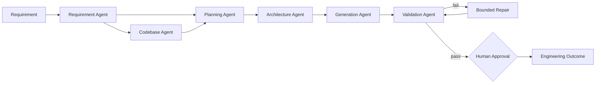

# Agentic SDLC Engineering System

A runnable prototype that transforms a software requirement into a **reviewable engineering outcome** through controlled, multi-step SDLC orchestration.

The system is intentionally **not a generic chatbot**. It separates requirement understanding, brownfield reasoning, planning, architecture, generation, validation, bounded recovery and human approval into explicit agents/stages.

## Assignment coverage

| Requirement | Implementation |
|---|---|
| Requirement understanding | `RequirementAgent` normalizes intent, flags ambiguity, records assumptions/acceptance criteria |
| Task decomposition | `PlanningAgent` creates tasks with explicit dependencies |
| Brownfield reasoning | `CodebaseAgent` inventories an optional existing codebase and identifies impact candidates |
| Multi-step orchestration | `WorkflowOrchestrator` coordinates shared state, dependencies, validation feedback and repair |
| Code/API/tests/docs generation | `GenerationAgent` emits a cohesive artifact bundle |
| Validation/risk control | `ValidationAgent` checks artifact completeness, syntax, contract consistency and guardrails |
| Error handling/recovery | Bounded repair/regeneration loop (`max_repair_attempts`) |
| Controlled autonomy | Automated agents + explicit final human approval gate |
| Structured final output | JSON + Markdown engineering summary per run |
| Mandatory URL shortener | Built-in reproducible scenario with generated FastAPI code, persistence, analytics, OpenAPI and tests |
| Greenfield/brownfield/ambiguous scenarios | `examples/` plus automated tests |

## Architecture



See [docs/ARCHITECTURE.md](docs/ARCHITECTURE.md) for design details.

## Quick start

### Option A — local Python

```bash
python3.11 -m venv .venv
source .venv/bin/activate          # Windows: .venv\\Scripts\\activate
pip install -e '.[dev]'
pytest -q
```

Run the exact mandatory requirement:

```bash
agentic-sdlc \
  --requirement "Build a scalable URL shortener service with APIs, persistence, and analytics."
```

The command prints a run ID and creates:

```text
outputs/<run-id>/
├── ENGINEERING_SUMMARY.md
├── engineering_summary.json
└── generated/
    ├── implementation_plan.md
    ├── openapi.yaml
    ├── url_shortener_api.py
    ├── url_shortener_service.py
    └── tests/test_url_shortener.py
```

Notice that a successful run still ends as `awaiting_human_approval` by default. To explicitly approve after validation:

```bash
agentic-sdlc \
  --requirement "Build a scalable URL shortener service with APIs, persistence, and analytics." \
  --approve
```

### Option B — API mode

```bash
uvicorn agentic_sdlc.api:app --reload
```

Then call:

```bash
curl -X POST http://127.0.0.1:8000/v1/runs \
  -H 'content-type: application/json' \
  -d '{"requirement":"Build a scalable URL shortener service with APIs, persistence, and analytics.","approve":false}'
```

Interactive API docs are at `/docs`.

### Option C — Docker

```bash
docker build -t agentic-sdlc .
docker run --rm -p 8000:8000 agentic-sdlc
```

## Example scenarios

### 1. Greenfield
Input: `examples/greenfield.txt`

The system identifies a greenfield build, decomposes work, chooses a service/repository architecture and produces the URL-shortener artifact bundle.

### 2. Brownfield
Input: `examples/brownfield.txt`

```bash
agentic-sdlc --requirement "Enhance the existing URL service to add click analytics without changing the current redirect contract." --codebase ./src
```

The CodebaseAgent inventories the supplied tree and feeds likely impact candidates into planning before architecture/generation.

### 3. Ambiguous
Input: `examples/ambiguous.txt`

```bash
agentic-sdlc --requirement "Make our URL API fast, secure and scalable."
```

The output records that terms such as *fast*, *secure* and *scalable* are not measurable and therefore need explicit NFR/SLO targets. The workflow can still build a reviewable draft while keeping assumptions visible for human review.

## Mandatory URL-shortener design

The generated reference service contains:
- `POST /v1/urls` — create a short URL;
- `GET /{code}` — redirect;
- `GET /v1/urls/{code}/analytics` — aggregate clicks;
- `GET /health` — health probe;
- input validation that accepts only absolute HTTP(S) URLs;
- collision retry for random short codes;
- repository abstraction with SQLite demo persistence;
- generated OpenAPI contract and integration-style tests.

### Production evolution
For real scale, keep stateless API instances, replace SQLite with PostgreSQL/DynamoDB, introduce Redis/cache for redirect-heavy reads, apply rate limiting, and move analytics to an asynchronous event pipeline when redirect write amplification becomes material.

## Validation and recovery

Validation is not a final prose statement; it changes execution. The validator checks mandatory files, compiles generated Python, checks API-contract completeness and scans for forbidden dynamic execution primitives. A failed check can trigger a bounded regeneration/repair pass. The workflow never loops indefinitely and never auto-deploys generated code.

See [docs/TESTING.md](docs/TESTING.md).

## Controlled autonomy

`approve=False` is the default. Automated agents may execute the engineering workflow, but a validated outcome remains `awaiting_human_approval`. `--approve` represents the explicit reviewer decision. This is the main safety boundary in the prototype.

## Design choices and limitations

1. **Deterministic agent implementation:** No paid LLM/API key is required, making the assessment reproducible for reviewers. The agent interfaces can later be backed by an LLM without changing the orchestration/validation contract.
2. **SQLite is a demo datastore:** It proves persistence with zero external infrastructure; it is not presented as the high-scale production choice.
3. **Brownfield reasoning is heuristic:** Production code intelligence would use AST/symbol graphs, dependency analysis, git history and targeted test selection.
4. **Guardrails are illustrative:** Production systems also need sandboxing, secrets controls, SAST/SCA, policy-as-code and CI/CD approvals.
5. **Generated code is reviewable, not auto-deployed:** Human ownership remains explicit.

## Repository structure

```text
.
├── src/agentic_sdlc/
│   ├── agents.py
│   ├── api.py
│   ├── cli.py
│   ├── models.py
│   └── orchestrator.py
├── tests/
├── examples/
├── docs/
├── Dockerfile
└── pyproject.toml
```

## Interview preparation

Use [docs/INTERVIEW_GUIDE.md](docs/INTERVIEW_GUIDE.md). It includes a 60-second explanation, demo order, architecture/trade-off answers, likely panel questions, and wording that is appropriate for an SRE/platform engineer rather than claiming deep AI-development experience.
