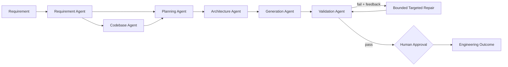

# Agentic SDLC Engineering System

A runnable prototype that transforms a software requirement into a **reviewable engineering outcome** through controlled, multi-step SDLC orchestration.

The system is intentionally **not a generic chatbot**. It separates requirement understanding, brownfield reasoning, planning, architecture, generation, validation, bounded recovery and human approval into explicit agents/stages.

## Assignment coverage

| Requirement | Implementation |
|---|---|
| Requirement understanding | `RequirementAgent` normalizes intent, flags ambiguity, records assumptions/acceptance criteria |
| Task decomposition | `PlanningAgent` creates dependency-aware tasks and adds context-specific brownfield work |
| Brownfield reasoning | `CodebaseAgent` inventories an optional codebase and identifies likely impacted files |
| Multi-step orchestration | `WorkflowOrchestrator` coordinates shared state, dependencies, validation feedback and repair |
| Code/API/tests/docs generation | `GenerationAgent` emits a cohesive artifact bundle |
| Validation/risk control | `ValidationAgent` checks completeness, syntax, contract consistency, guardrails and executes generated tests |
| Error handling/recovery | Failed checks become repair actions used by a bounded targeted repair pass |
| Controlled autonomy | Automated agents + explicit final human approval gate |
| Structured final output | JSON + Markdown engineering summary per run |
| Mandatory URL shortener | Built-in scenario with FastAPI code, persistence, analytics, OpenAPI and tests |
| Greenfield/brownfield/ambiguous scenarios | `examples/` includes inputs and committed review snapshots |

## Architecture



See [docs/ARCHITECTURE.md](docs/ARCHITECTURE.md) for design details.

## Quick start

```bash
python3.11 -m venv .venv
source .venv/bin/activate          # Windows: .venv\Scripts\activate
pip install -e '.[dev]'
pytest -q
```

Run the exact mandatory requirement:

```bash
agentic-sdlc \
  --requirement "Build a scalable URL shortener service with APIs, persistence, and analytics."
```

The command prints a run ID and creates:

```text
outputs/<run-id>/
├── ENGINEERING_SUMMARY.md
├── engineering_summary.json
└── generated/
    ├── implementation_plan.md
    ├── openapi.yaml
    ├── url_shortener_api.py
    ├── url_shortener_service.py
    └── tests/test_url_shortener.py
```

A successful run still ends as `awaiting_human_approval` by default. Explicit reviewer approval is separate:

```bash
agentic-sdlc \
  --requirement "Build a scalable URL shortener service with APIs, persistence, and analytics." \
  --approve
```

## API mode

```bash
uvicorn agentic_sdlc.api:app --reload
```

```bash
curl -X POST http://127.0.0.1:8000/v1/runs \
  -H 'content-type: application/json' \
  -d '{"requirement":"Build a scalable URL shortener service with APIs, persistence, and analytics.","approve":false}'
```

Interactive API docs are available at `/docs`.

## Docker

```bash
docker build -t agentic-sdlc .
docker run --rm -p 8000:8000 agentic-sdlc
```

## Example scenarios and committed outputs

The repository includes reviewer-friendly snapshots under `examples/sample_outputs/` so each scenario can be inspected without first running the program.

### 1. Greenfield / mandatory URL shortener
Input: [`examples/greenfield.txt`](examples/greenfield.txt)  
Output: [`examples/sample_outputs/greenfield/ENGINEERING_SUMMARY.md`](examples/sample_outputs/greenfield/ENGINEERING_SUMMARY.md)

### 2. Brownfield enhancement
Input: [`examples/brownfield.txt`](examples/brownfield.txt)

A small fixture codebase is provided at `examples/brownfield_fixture/` to make the impact-aware plan reproducible:

```bash
agentic-sdlc \
  --requirement "Enhance an existing URL shortener service to add click analytics without changing the current redirect contract." \
  --codebase ./examples/brownfield_fixture
```

Output: [`examples/sample_outputs/brownfield/ENGINEERING_SUMMARY.md`](examples/sample_outputs/brownfield/ENGINEERING_SUMMARY.md)

The planner adds API compatibility, service logic, data-model/migration and regression-test tasks when matching impacted files are found.

### 3. Ambiguous requirement
Input: [`examples/ambiguous.txt`](examples/ambiguous.txt)

```bash
agentic-sdlc --requirement "Make our URL shortener API fast, secure and scalable."
```

Output: [`examples/sample_outputs/ambiguous/ENGINEERING_SUMMARY.md`](examples/sample_outputs/ambiguous/ENGINEERING_SUMMARY.md)

The requirement agent records that *fast*, *secure* and *scalable* are not measurable until explicit NFR/SLO targets are supplied.

## Mandatory URL-shortener design

The generated reference service contains:
- `POST /v1/urls` — create a short URL;
- `GET /{code}` — redirect;
- `GET /v1/urls/{code}/analytics` — aggregate clicks;
- `GET /health` — health probe;
- HTTP(S)-only URL validation;
- collision retry for random short codes;
- repository abstraction with SQLite demo persistence;
- generated OpenAPI contract and integration-style tests.

### Production evolution
For real scale, keep stateless API instances, replace SQLite with PostgreSQL/DynamoDB, introduce Redis/cache for redirect-heavy reads, apply rate limiting, and move analytics to an asynchronous event pipeline when redirect write amplification becomes material.

## Validation and recovery

Validation changes execution rather than merely producing prose. The validator checks mandatory artifacts, compiles generated Python, scans for forbidden dynamic execution primitives, verifies required OpenAPI paths, materializes generated artifacts into a temporary workspace, and runs the generated test suite with a timeout.

If a check fails, `ValidationResult.repair_actions` are passed back into `GenerationAgent.repair()` so affected artifacts can be restored/regenerated before one bounded re-validation attempt. The workflow never loops indefinitely and never auto-deploys generated code.

See [docs/TESTING.md](docs/TESTING.md).

## Controlled autonomy

`approve=False` is the default. Automated agents may execute the engineering workflow, but a validated outcome remains `awaiting_human_approval`. `--approve` represents the explicit reviewer decision.

## Design choices and limitations

1. **Deterministic agent implementation:** No paid LLM/API key is required, making evaluation reproducible. Agent interfaces can later be backed by an LLM without changing the orchestration/validation contract.
2. **SQLite is a demo datastore:** It proves persistence with zero external infrastructure; PostgreSQL/DynamoDB plus caching would be more appropriate at scale.
3. **Brownfield reasoning is heuristic:** Planning now consumes file-impact context, but production code intelligence should add AST/symbol graphs, dependency analysis, git history and targeted test selection.
4. **Generated-test isolation is lightweight:** Tests run in a temporary workspace with a timeout; production autonomous execution should use stronger container/VM isolation and resource/network controls.
5. **Generated code is reviewable, not auto-deployed:** Human ownership remains explicit.

## Repository structure

```text
.
├── src/agentic_sdlc/
│   ├── agents.py
│   ├── api.py
│   ├── cli.py
│   ├── models.py
│   └── orchestrator.py
├── tests/
├── examples/
│   ├── brownfield_fixture/
│   └── sample_outputs/
├── docs/
├── Dockerfile
└── pyproject.toml
```
