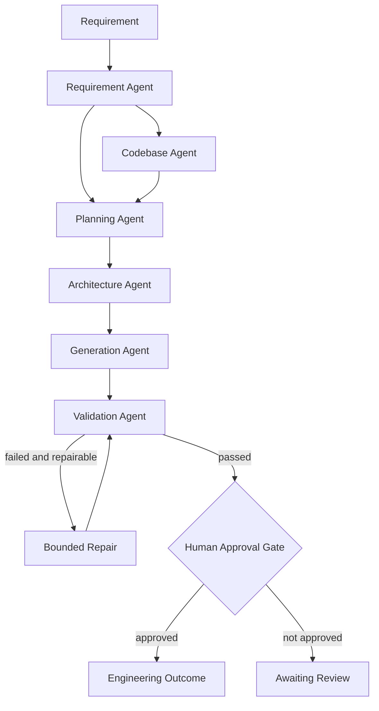

# Architecture Overview

## Purpose
The prototype converts a software requirement into a reviewable engineering outcome using specialized agents coordinated by an orchestrator. It is deliberately not a generic chatbot.

## Agent responsibilities

| Agent | Responsibility | Output |
|---|---|---|
| RequirementAgent | Intent, normalization, ambiguity and assumptions | RequirementAnalysis |
| CodebaseAgent | Brownfield file/impact reasoning | Codebase impact context |
| PlanningAgent | Dependency-aware task graph | Tasks |
| ArchitectureAgent | Components, APIs, persistence, scaling, security, observability | ArchitectureDecision |
| GenerationAgent | Code, contract, tests and plan | Artifact bundle |
| ValidationAgent | Completeness, syntax, contract and safety checks | ValidationResult |
| Human gate | Explicit oversight after automated validation | Approval state |

## Cross-step coordination
Planning uses both requirement analysis and codebase reasoning. Architecture consumes normalized intent and assumptions. Generation is architecture-aware. Validation checks generation against mandatory domain expectations. Failed validation enters a bounded regeneration/repair loop rather than proceeding directly to approval.

## Controlled autonomy
Agents can execute without a person between every step, but the workflow is constrained by deterministic tool boundaries, a maximum repair count, validation guardrails and a final explicit approval state. The prototype never deploys generated code automatically.

## Brownfield design
The prototype accepts `--codebase` and performs non-destructive inventory/impact reasoning. For production, this should be extended with language-aware AST/symbol extraction, dependency graphs, repository history and test-impact analysis.
