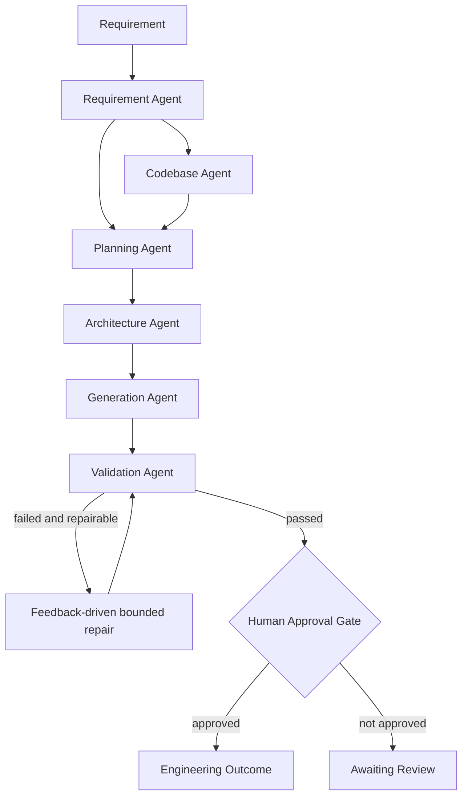

# Architecture Overview

## Purpose
The prototype converts a software requirement into a reviewable engineering outcome using specialized agents coordinated by an orchestrator. It is deliberately not a generic chatbot.

## Agent responsibilities

| Agent | Responsibility | Output |
|---|---|---|
| RequirementAgent | Intent, normalization, ambiguity and assumptions | RequirementAnalysis |
| CodebaseAgent | Brownfield file/impact reasoning | Codebase impact context |
| PlanningAgent | Dependency-aware task graph, including context-specific brownfield tasks | Tasks |
| ArchitectureAgent | Components, APIs, persistence, scaling, security, observability | ArchitectureDecision |
| GenerationAgent | Code, contract, tests and plan; targeted repair of failed artifacts | Artifact bundle |
| ValidationAgent | Completeness, syntax, contract, safety and generated-test execution | ValidationResult |
| Human gate | Explicit oversight after automated validation | Approval state |

## Cross-step coordination
Planning consumes both requirement analysis and codebase reasoning. In brownfield mode, detected API/route, service, model/schema/database, and test impacts create additional dependency tasks before architecture. Generation consumes architecture decisions. Validation executes deterministic checks plus the generated test suite. Failed checks become explicit repair actions that are passed back into targeted repair before re-validation.

## Controlled autonomy
Agents can execute without a person between every step, but the workflow is constrained by deterministic tool boundaries, a maximum repair count, validation guardrails, time-bounded generated tests, and a final explicit approval state. The prototype never deploys generated code automatically.

## Brownfield design
The prototype accepts `--codebase` and performs non-destructive inventory/impact reasoning. File impacts change the task graph, making API compatibility, service behavior, data-model/migration, and regression-test work explicit when matching areas are detected. For production, this should be extended with language-aware AST/symbol extraction, dependency graphs, repository history and test-impact analysis.
